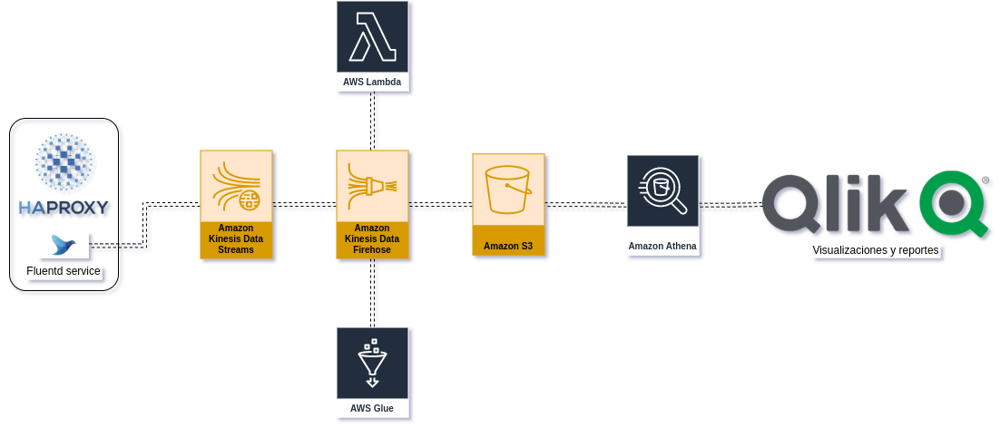

---
hide:
  - footer
---

# Diagrama de arquitectura

## Descripción de la arquitectura

La arquitectura se basa en elementos serverless y se compone de los siguientes elementos:

- **Fluentd en un HAProxy**: Recibe los logs de las aplicaciones y los manda a Kinesis Data Streams
- **Kinesis Data Streams**: Recibe los logs de las aplicaciones con una retención de 24 horas y los manda a Kinesis Data Firehose
- **Kinesis Data Firehose**: Recibe los logs de Kinesis Data Streams, la **lambda** los procesa y **Glue** los estructura y los manda a S3
- Se utilizarán herramientas de **visualización** como Tableau
