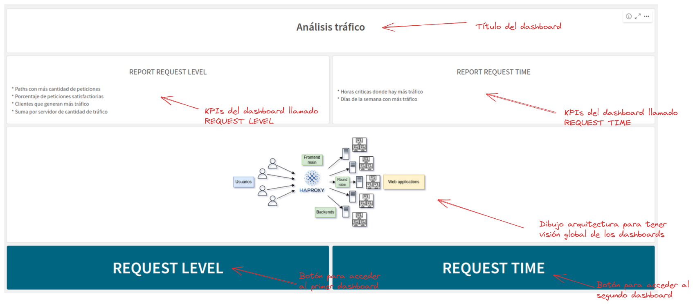
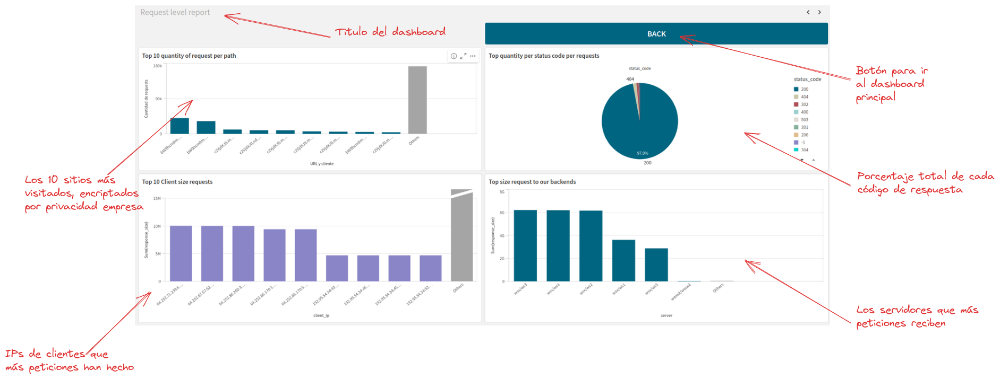
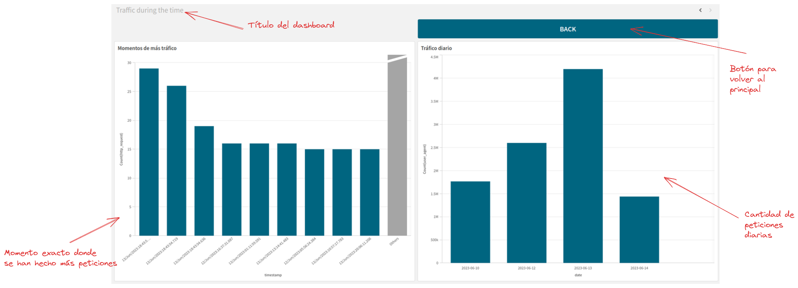

---
hide:
  - footer
---

# Objetivos

Este repositorio está destinado a cubrir la necesidad de crear infraestructura en la nube de forma automatizada y por código versionado para la ingesta de datos en un entorno de producción. El analisis se realizará a posteriorí y toda la literatura del trabajo estará en el repositorio de trabajos de fin de máster de la Universidad Alfonso X el Sabio.

## Cuadro de mando principal

## Cuadro de mando nivel de peticiones

## Cuadro de mando tiempos en peticiones

